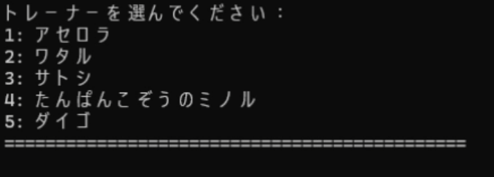
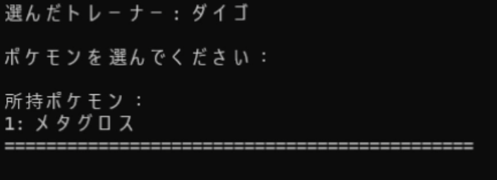
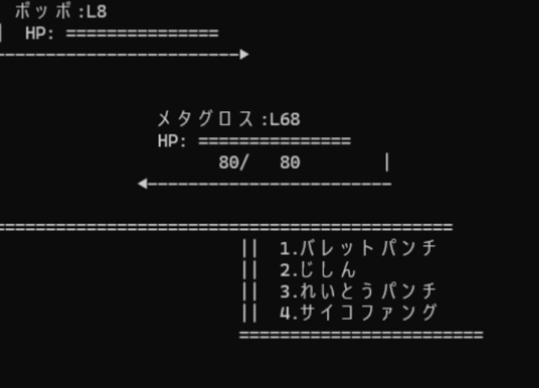
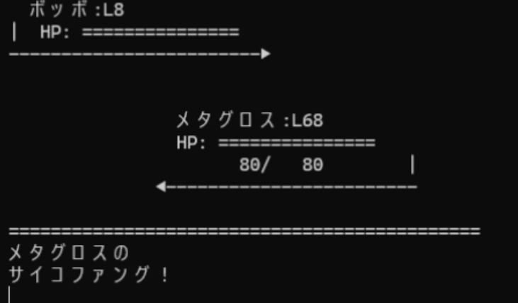
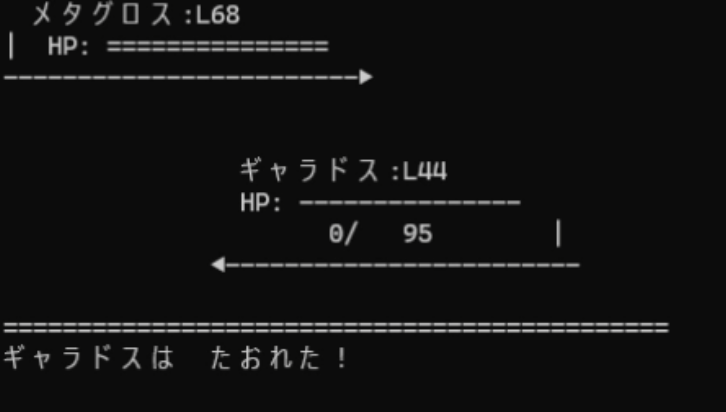

# Pokemon Battle CLI


[](https://www.rust-lang.org/)
[](https://opensource.org/licenses/MIT)

## Overview

While engines like Unity allow for richer graphics and easy WebGL deployment, this project deliberately focuses on building a lightweight, fully offline-compatible Pokémon battle system using pure Rust. The goal is to demonstrate fundamental game system design and command-line architecture using a modern systems programming language.

## Screenshots

### Select a trainer



### Select a Pokémon



### Start a Battle





### End a Battle



## Purpose

This project aims to offer a minimalist implementation of the Pokémon battle system using only Rust, without any external game engine. It is intended as a portfolio piece to showcase basic game architecture, logic structuring, and Rust development skills, particularly in environments where GUI or WebGL is not feasible.

## Features

This project supports a variety of basic battle features:

- Load and parse trainers and Pokémon data from JSON files
- Select trainers and Pokémon interactively via CLI
- Battle system supporting:
  - Physical moves
  - Special moves
  - Status effect moves
  - OHKO (One-Hit Knock Out) moves
- Each move has a probability of success, simulating in-game accuracy mechanics

## Technical Implementation

- Rust v1.86
- Serde v1
- Serde JSON v1

## Building from Source

```sh
cargo build --release
```

## Usage

```sh
./target/release/pokemon-battle-system
```

## Future Development

- Add status effects like poison or paralysis
- Implement battle animations using terminal graphics (e.g., with crossterm)
- Expand to web-based frontend using WebAssembly
- Refactor the battle system using asynchronous processing with Tokio
- Implement type effectiveness (e.g., Fire > Grass, Water > Fire)
- Separate Pokémon instances for the player and enemy trainers
- Add a leveling system with experience points and stat progression
- Enable the use of multiple Pokémon per trainer (party-based battles)

## License

<p>MIT License</p>

## Author

**itsakeyfut**

Feel free to contact me for collaboration or job opportunities.
